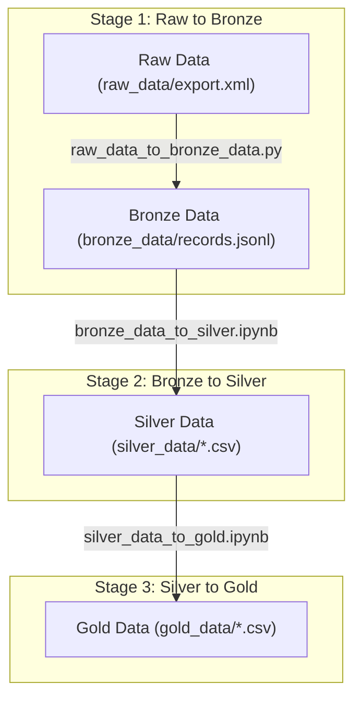

# Apple Health Data Analysis

This project aims to use the Apple Health data from the Apple watch and Withings smart scale to do analysis how the health markers change quantitatively based on my dietary changes

## Overview
* Apple Health on an iPhone is a treasure trove of data especially if paired with devices like Apple Watch and smart scale
* Exporting this data is very archaic, we do get a massive XML file (> 1 GB) which we need to wrestle with to make it useful for our needs
* We decode this XML file (located in `raw_data/`) into a more friendly JSON format and do a very basic filtering based off of:
    * Data from January 1st, 2025 onwards
    * Selecting only the following metrics
        * BodyMass
        * LeanBodyMass
        * BodyFatPercentage
        * HeartRate
        * RestingHeartRate
        * WalkingHeartRateAverage
        * HeartRateVariabilitySDNN
* This gives us a more manageable 21 MB line-separated JSON file in bronze_data
* This line-separated JSON data is further refined by dropping unnecessary columns and splitting the data for each metric into its own CSV file (see `bronze_data_to_silver.ipynb`)
* These CSV data is then further refined by (see `silver_data_to_gold.ipynb`):
    * using mean value of the metric for an entire day
    * interpolating missing values
    * adding 'on diet' metric

## Setup steps
* Make sure `python3` and `poetry` are installed in your system
* Run `poetry install --no-root` to install the dependencies

## Running project scripts
* Export the Apple Health data and unzip it
* Copy the **export.xml** from Apple Health export to `raw_data/export.xml`
* Run `poetry run python raw_data_to_bronze_data.py`
* Run `poetry run jupyter notebook`
* Run all the code blocks in the notebook `bronze_data_to_silver.ipynb`
* Run all the code blocks in the notebook `silver_data_to_gold.ipynb`

## Process Flow Diagram

## Future Iterations
* Quantify the changes in other metrics w.r.t.'on diet'.
* Add more metrics from raw data for analysis.
* Do more advanced aggregation of metrics instead of current simple average for daily intervals.
